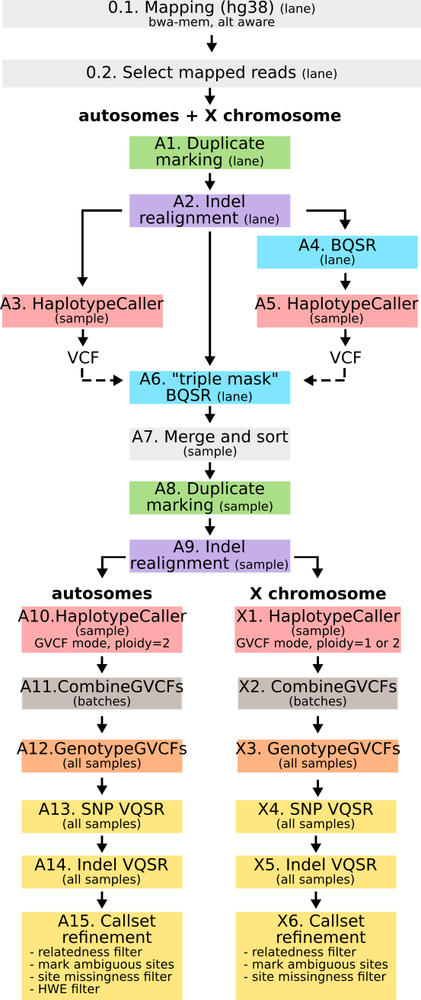

- [ ] Add information about the QC

This folder contains information regarding how the data was generated (from raw reads to refined callset).

The numbers refer to the processing flowchart:

<!-- prettier-ignore -->

    

# Mapping

## Step 0.1

We mapped reads to GRCh38 using bwakit/0.7.12 `bwa-mem` with the alt-aware procedure. The resulting BAM file was sorted and indexed. The mapping was done by lane for the data generated in this study, and by what we assumed to be lanes for the comparative dataset. The code changes depending on the input:

- FASTQ: data generated in this study, SGDP (except "SGDP letter") and KGP: [step0.1.a_mapping.sh](step0.1.a_mapping.sh)
- mapped BAM: SGDP letter (IGB1, IGB2, KON2, LEM1, LEM2), HGDP, SAHGP: [step0.1.b_mapping.sh](step0.1.b_mapping.sh)
- mapped BAM from which reads of interest need to be extracted: Schlebusch et al. 2020 (the same 25 Khoe-San individuals as included in this study):  [step0.1.c_mapping.sh](step0.1.c_mapping.sh)

## Step 0.2

In order to reduce the size of the BAM files we split the indexed BAM bwa into one BAM containing mapped reads and one containing unmapped reads (with samtools/1.1). Only the files with mapped reads were processed further. This is done in: [step_0.2_split-mapped-unmapped.sh](step_0.2_split-mapped-unmapped.sh)

# Processing autosomes and chromosome X

Steps A1 to A9 are common to the autosomes and the chromosome X. From step A10, the autosomes (chromosomes 1 to 22) are extracted. See separate steps for chromosome X.

We adapted the “GATK Best Practices” (McKenna et al. 2010)⁠ for the processing of the autosomes and of the X chromosome to retain as much diversity as possible ([processing pipeline](link to the processing pipeline), Breton et al. 2021, Schlebusch et al. 2020). We used GATK/3.5 for most steps. In particular our pipeline includes the step “realignment around indels” as recommended prior to release of GATK/3.6. We used GATK/3.7 from the final HaplotypeCaller command and downstream, due to an issue with the MQ (mapping quality) estimates with older versions. [processing pipeline](link to the processing pipeline) specifies at which level – lane, sample, batch or all samples – each step was performed. Only the final steps (joint genotyping and refinement of the callset) are performed on all samples together, making it easy to add new samples as more data is generated.

## Processing by lane: steps A1 and A2

We marked duplicate reads with picard/1.126: [step_A.1_mark-duplicates.sh](step_A.1_mark-duplicates.sh)

We realigned around indels with GATK/3.5.0: [step_A.2_indel-realignment.sh](step_A.2_indel-realignment.sh)

For realignment, the interval list file contains the 22 autosomes as well as chromosomes X, Y and the mitochondria. Moreover it contains contigs of the type “chr1_KI270706v1_random”, that are known to belong to a specific chromosome but for which the exact order or orientation is unknown, and contigs of the type “chrUn_KI270302v1” that cannot be confidently located on a specific chromosome. It does not contain the alt contigs.

## Triple mask BQSR: steps A3 to A6

Steps A3 to A6 correspond to the process we name “triple mask BQSR” (Schlebusch et al. 2020, Breton et al. 2021)⁠ where BQSR stands for Base Quality Score Recalibration, a step which aims at calculating more accurate quality scores than those outputed by the sequencing machine. Briefly, instead of using only the standard reference dataset dbSNP to train the model, we first call variants for the specific individual and use the resulting VCF to train the model. GATK/3.5, samtools/1.1, picard/1.126, GATK/3.5, vcftools/0.1.13, tabix/0.2.6 and dbSNP144 were used throughout these steps.

From this step onward, only the autosomes (inclunding the "unknown" and "random" contigs) and chromosome X are considered.

We start by calling variants on the output of step A2; to that end, we first merge the different BAM files for each sample. This results in a first sample-specific VCF file. This is done in [step_A.3_variant-calling.sh](step_A.3_variant-calling.sh).

In parallel, we perform a standard BQSR (by lane) on the output of step A2: [step_A.4_dbsnp-BQSR.sh](step_A.4_dbsnp-BQSR.sh). In step A5, we merge the resulting BAM and call variants (same procedure as in A3); we obtain a second sample-specific VCF file. This is done in [Create step_A.5_variant-calling.sh](Create step_A.5_variant-calling.sh).

Finally, we proceed with the “triple mask BQSR” (by lane, step A6) on the output of step A2; we provide the two VCF files as known sites, together with dbSNP: [step_A.6_triple-mask-BQSR.sh](step_A.6_triple-mask-BQSR.sh).

## Processing by sample: steps A7 to A9

In steps A7 to A9, we prepare a final BAM file for each sample:

- in step A7, the outputs (by lane) of step A6 are merged and sorted: [step_A.7_merge-and-sort.sh](step_A.7_merge-and-sort.sh)
- in step A8, duplicates are marked: [step_A.8_mark-duplicates.sh](step_A.8_mark-duplicates.sh)
- and in step A9, indels are realigned: [step_A.9_indel-realignment.sh](step_A.9_indel-realignment.sh)

## Variant calling: steps A10 to A12

The next three steps are the variant calling steps and concern only the autosomes, which are selected with a new interval list file. We use GATK/3.7. Variant calling is decomposed in three steps:

- First, variants are called in each individual, resulting in a GVCF file (step A10). We use the variant caller HaplotypeCaller in genotyping mode `DISCOVERY` and with the option `emitRefConfidence BP_RESOLUTION`. As we want to obtain a final VCF with information about all sites we do not use the option recommended by GATK Best Practices – `emitRefConfidence GVCF` - where information is condensed in “blocks” for the non-variable positions. We use tabix/0.2.6 to bgzip and index the output. This is done in [step_A.10_variant-calling.sh](step_A.10_variant-calling.sh).
- The second step (A11) is to use the tool CombineGVCF to obtain multi-sample GVCF files. This speeds up the following step (joint genotyping). We found that combining the 49 individuals from the central African dataset; the 25 individuals from the southern African dataset with the 24 SAHGP individuals; and the 81 remaining comparative individuals, allowed for a reasonably fast joint genotyping step. This is done in [step_A.11_combine-GVCF.sh](step_A.11_combine-GVCF.sh).
- Finally, the third and last step (A12) is to jointly genotype all individuals with GenotypeGVCF: [step_A.12_joint-genotyping.sh](step_A.12_joint-genotyping.sh).

## Callset refinement: steps A13 to A15

### VQSR (steps A13 and A14)

GATK's Variant Quality Score Recalibration (VQSR) step recalibrates variant quality scores and produces a filtered callset. It is preferred to hard filtering. After building a recalibration model with VariantRecalibrator, the user chooses a threshold – called “tranche level” - for the filtering of the callset (performed with ApplyRecalibration). The higher that threshold, the more false positives the callset might contain. For the SNPs we chose a tranche level of 99.9 and for the indels of 99.0.

We performed the SNP VQSR first: step A13, [step_A.13_SNP-VQSR.sh](step_A.13_SNP-VQSR.sh).

Then we used the output of step A13 to perform the indel VQSR: step A14, [step_A.14_indel-VQSR.sh](step_A.14_indel-VQSR.sh).

### Additional filtering (step A15)

Additional filtering consists in (i) excluding two samples from the callset due to first degree relatedness to other samples, and (ii) filtering sites that are uncalled in the reference genome, have high missingness, or are heterozygous in all individuals. This is done in [step_A.15_filtering-after-VQSR.sh](step_A.15_filtering-after-VQSR.sh). More specifically:

#### Relatedness filtering

We excluded the two samples with GATK SelectVariants. We used the option “trimAlternates” to restrict the callset to the variation present in the 177 unrelated samples (while keeping all sites – we are only modifying the variant positions). We note that the sites which were variable in the total callset (179 individuals) and are not variable in the unrelated callset (177 individuals) appear as variable sites with “.” as alternate allele. It is not possible to make these entries look like usual non-variable sites using GATK tools (unless running GenotypeGVCF again without the two related individuals). This is a potential issue for downstream tools, as these sites might be counted as biallelic SNP monomorphic in the callset, even if all individuals are homozygous reference.

#### Other filtering

We used vcftools `--missing-site` to calculate missingness per site and vcftools `--hardy` to test for Hardy Weinberg equilibrium (HWE). We then changed the filter field in the VCF for: sites with a 'N' in the reference genome (to FAIL1_N); sites with more than 10% missingness (to FAIL2_M); and sites heterozygous in all samples (to FAIL3_H) - using bash and awk commands. HWE-filtering at population-level is hindered by the small sample sizes. Finally, we modified the VCF header to include information about the new filter flags we introduced.

# End of processing chromosome X

For the start of the processing, see steps A1 to A9. The X chromosome is processed together with the autosomes up to (but excluding) the variant calling step. The input to step X1 is a triple-mask-BQSRed, dedup, and realigned BAM.

## Variant calling: steps X1 to X3

The variant calling is similar to steps A10 to A12 in the autosomes: HaplotypeCaller is run for each sample [step_X.1_variant-calling.sh](step_X.1_variant-calling.sh), then a multi-sample GVCF is obtained with CombineGVCF [step_X.2_combine-GVCF.sh](step_X.2_combine-GVCF.sh), and finally all samples are jointly genotyped with GenotypeGVCF [step_X.3_joint-genotyping.sh](step_X.3_joint-genotyping.sh). Note that the ploidy was set to 1 for males and 2 for females at the HaplotypeCaller step. At the CombineGVCF step, all samples were included.

## Callset refinement: steps X4 to X6

### VQSR (steps X4 and X5)

Three filtering approaches were compared for the SNPs on the X chromosome: GATK VQSR with only the X chromosome variants as input for the VariantRecalibrator step, tranche level of 99.9; GATK VQSR with the X and the autosomes variants as input for the VariantRecalibrator step, tranche level of 99.9; and hard filtering with GATK SelectVariants and VariantFiltration and the following thresholds: FisherStrand (FS>60.0), QualByDepth (QD<2.0), RMSMappingQuality (MQ<40.0), StrandOddsRatio (SOR>3), MappingQualityRankSumTest (MQRankSum<12.5), and ReadPosRankSumTest (ReadPosRankSum< -8.0).

Based on the number of variants kept by each approach and the overlap between the callsets, we decided to continue with the VQSR where both the X chromosomal and the autosomal variants are fed to VariantRecalibrator, for the SNP - see [step_X.4_SNP-VQSR.sh](step_X.4_SNP-VQSR.sh) - and the indels - [step_X.5_indel-VQSR.sh](step_X.5_indel-VQSR.sh). 

### Additional filtering (step X5)

Further filtering of the X callset is similar to the autosomal callset and includes: relatedness filtering (the same two individuals were excluded like for the autosomes); and marking sites with a “N” in the reference genome or more than 10% missingness as fail. It is described in [step_X.6_filtering-after-VQSR.sh](step_X.6_filtering-after-VQSR.sh). Note that the `trimAlternates` option of SelectVariants could not be used.

# Quality control

xxx
